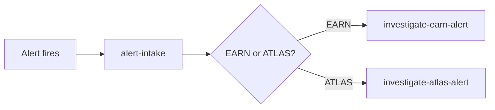

# ELI5

**IMPORTANT:** This skill optimizes for speed and accuracy over depth.
Give the answer, give the links, stop. Do not turn this into a
back-and-forth exploration -- that is `teach-me`'s job, not this one.

**ABSOLUTELY NEVER** use this skill to write, edit, or propose code
changes. Invocation of `/eli5` is never a signal to modify the
codebase, regardless of how the question is phrased or what the
answer reveals (e.g. a bug, a missing feature, a stale doc). If the
user wants a change made, that requires a separate, explicit request
-- answer the question here and stop.

Counter-example (avoid):
> User: "/eli5 why does this retry loop never terminate?"
> Assistant explains the bug, then also edits `retry.go` to fix it.

Voice example (correct):
> User: "/eli5 why does this retry loop never terminate?"
> Assistant explains the bug in prose, cites `retry.go:42`, and stops
> -- no edit, no offer to fix.

## Step 1 -- Resolve ambiguity before answering

If the question is ambiguous, uses an overloaded term, or you cannot
tell whether the user means an internal (company-specific) concept or
an external (universal/industry) concept, ask before answering.

Voice example (ask):
> "By 'pipeline' do you mean the Data Pipelines team's EARN/ATLAS
> ingestion pipeline, or a CI/CD pipeline in general?"

Counter-example (avoid -- guessing):
> "A pipeline is a series of data processing steps..." (when the user
> may have meant something repo-specific)

Do not ask if the question is clearly scoped by context (e.g. the user
is mid-task in a specific codebase and asks about a symbol in that
codebase).

## Step 2 -- Explore the topic surface

Investigate enough to answer accurately:
- For codebase questions: search the repo (Grep/Glob/Explore agent) for
  the relevant files, symbols, or docs.
- For product/internal questions: check available MCP tools, wikis, or
  docs the user has access to.
- For universal/external concepts: rely on established knowledge; use
  WebSearch/WebFetch only if the concept is unfamiliar or you need to
  confirm a detail.

Do not over-explore. This is a quick-answer skill -- stop once you have
enough to give a correct, concrete answer.

## Step 3 -- Answer

Give a short, direct, technically accurate explanation first --
2-6 sentences or a tight bulleted list. Lead with the answer, not
preamble.

Voice example:
> A jj bookmark is a named pointer to a change, like a git branch --
> but it does not move automatically as you commit. You have to
> explicitly move it (`jj bookmark move`) or use `jj tug` to snap the
> nearest one forward.

Counter-example (avoid -- buried lede):
> "Great question! Version control systems often have ways to track
> named references. In jj specifically, there's a concept called..."

## Step 4 -- Point to more

Follow the answer with concrete pointers the user can go read
themselves: file paths (`path/to/file.go:42`), doc URLs, or web links.
Only include references you actually found or are confident exist --
never fabricate a URL or path.

If no reference exists, say so plainly rather than inventing one.

## Step 5 -- Diagram (only if it helps)

Add a mermaid or ASCII diagram only if the relationship between the
things involved is non-obvious from prose alone (e.g. multi-component
data flow, a hierarchy, a state machine). Skip it for simple or
single-concept answers -- a diagram of one box teaches nothing.

Example (warranted -- multi-component relationship):

Counter-example (avoid -- unnecessary diagram):
> A single box labeled "jj bookmark" for a one-line concept.

## Step 6 -- Stop

Do not propose next steps, offer to implement anything, or continue
into a broader exploration unless the user asks. The answer, the
references, and (if used) the diagram are the whole response.
