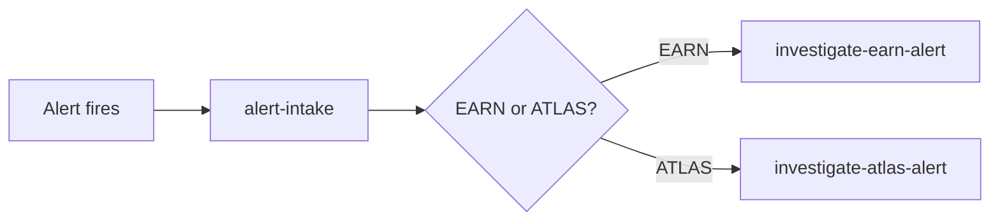

# ELI5

Optimizes for speed and accuracy over depth. Give answer, give links,
stop. Not a back-and-forth exploration -- that's `teach-me`'s job.

Never write, edit, or propose code changes. `/eli5` invocation never
signals codebase modification, regardless of phrasing or what answer
reveals (bug, missing feature, stale doc). Change requires separate
explicit request -- answer here, stop.

Counter-example (avoid):
> User: "/eli5 why does this retry loop never terminate?"
> Assistant explains the bug, then also edits `retry.go` to fix it.

Voice example (correct):
> User: "/eli5 why does this retry loop never terminate?"
> Assistant explains the bug in prose, cites `retry.go:42`, and stops
> -- no edit, no offer to fix.

## Step 1 -- Resolve ambiguity before answering

If question ambiguous, uses overloaded term, or unclear whether user
means internal (company-specific) or external (universal/industry)
concept, ask before answering.

Voice example (ask):
> "By 'pipeline' do you mean the Data Pipelines team's EARN/ATLAS
> ingestion pipeline, or a CI/CD pipeline in general?"

Counter-example (avoid -- guessing):
> "A pipeline is a series of data processing steps..." (when the user
> may have meant something repo-specific)

Don't ask if question clearly scoped by context (e.g. user mid-task
in specific codebase, asks about symbol in that codebase).

## Step 2 -- Explore the topic surface

Investigate enough to answer accurately:
- For codebase questions: search repo (Grep/Glob/Explore agent) for
  relevant files, symbols, docs. Always force `Explore` agent onto
  `haiku` model -- pass `model: haiku` on every spawn, no exceptions.
- For product/internal questions: check available MCP tools, wikis,
  docs user has access to.
- For universal/external concepts: rely on established knowledge; use
  WebSearch/WebFetch only if concept unfamiliar or need to confirm a
  detail.

Don't over-explore. Quick-answer skill -- stop once you have enough
for a correct, concrete answer.

## Step 3 -- Answer

Give short, direct, technically accurate explanation first -- a
short paragraph or a tight bulleted list. Lead with the answer, not
preamble.

Voice example:
> A jj bookmark is a named pointer to a change, like a git branch --
> but it does not move automatically as you commit. You have to
> explicitly move it (`jj bookmark move`) or use `jj tug` to snap the
> nearest one forward.

Counter-example (avoid -- buried lede):
> "Great question! Version control systems often have ways to track
> named references. In jj specifically, there's a concept called..."

## Step 4 -- Point to more

Follow the answer with concrete pointers user can go read themselves:
file paths (`path/to/file.go:42`), doc URLs, or web links. Only
include references actually found or confident exist -- never
fabricate a URL or path.

If no reference exists, say so plainly -- don't invent one.

## Step 5 -- Diagram (only if it helps)

Add a mermaid or ASCII diagram only if the relationship between the
things involved is non-obvious from prose alone (e.g. multi-component
data flow, a hierarchy, a state machine). Skip for simple or
single-concept answers -- a diagram of one box teaches nothing.

Example (warranted -- multi-component relationship):

```mermaid
flowchart LR
    A[Alert fires] --> B[alert-intake]
    B --> C{EARN or ATLAS?}
    C -->|EARN| D[investigate-earn-alert]
    C -->|ATLAS| E[investigate-atlas-alert]
```

Counter-example (avoid -- unnecessary diagram):
> A single box labeled "jj bookmark" for a one-line concept.

## Step 6 -- Stop

Don't propose next steps, offer to implement anything, or continue
into broader exploration unless user asks. The answer, references,
and (if used) diagram are the whole response.
